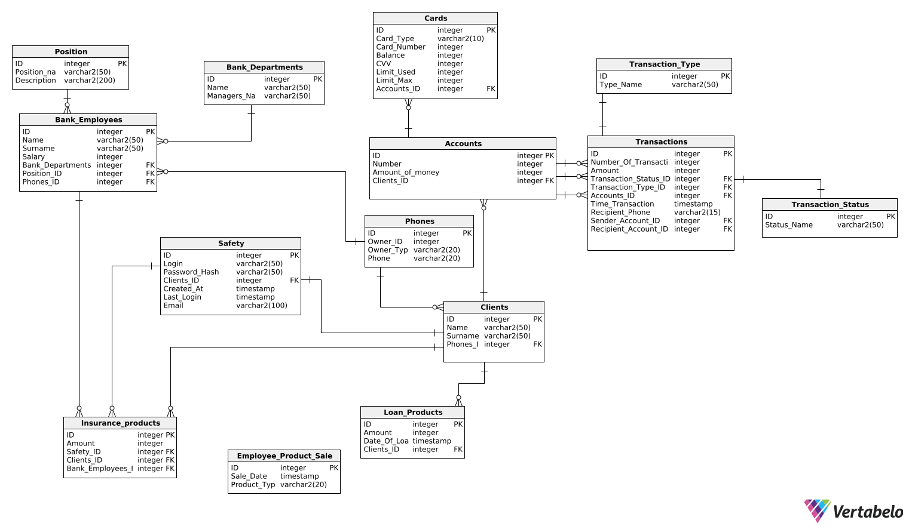

# 🏦 Bank SQL Schema Project

This project contains a full SQL relational database schema for a simulated banking system. Designed using JetBrains DataGrip, the database models clients, employees, departments, accounts, transactions, loans, cards, and insurance products.

## 📂 Files

- `create_schema.sql` – Creates all tables and foreign key relationships
- `drop_schema.sql` – Drops all the database objects
- `sample_queries.sql` – Contains example queries to test and use the schema
- `BankERD.png` – Entity-Relationship Diagram of the database schema

## 🧩 Main Entities

- **Clients**, **Phones**
- **Bank Employees**, **Departments**, **Positions**
- **Accounts**, **Cards**, **Transactions**
- **Loans**, **Insurance Products**
- **Login security** (with password hash, timestamps)

## 🔧 Use Case

- Ideal for learning SQL, relational modeling, normalization, JOINs
- Can be used in backend/database API projects
- University coursework or portfolio showcase

## 🖼️ ER Diagram

---

> Created for educational purposes and real SQL practice.
